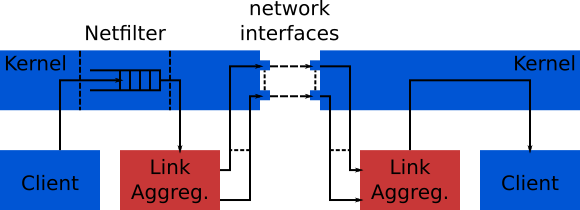
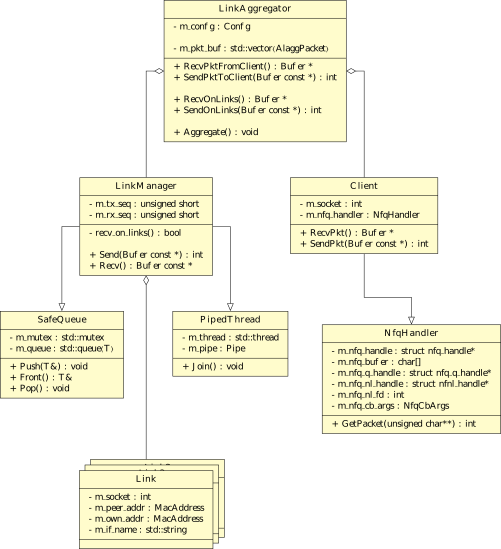

Protocol-Agnostic Link Aggregator (Alagg)
========================

Alagg is a protocol-agnostic, bidirectional link aggregator operating in user
space. The application is operating on both the transmitting as well as the
receiving side of the connection.

Overview
========

Alagg transparently proxies traffic destined for specific destinations.
Traffic is intercepted using netfilter/iptables. The packets are enqueued in a
netfilter queue in the kernel, rather than sent on the network. The Application
can then retreive the intercepted packets using the nfnetlink/netfilter\_queue
libraries, and the kernel is told to drop the packet.
The intercepted raw IP packets are wrapped inside a small link layer protocol
(the Alagg protocol) and reduntantly transmitted in the link layer.
The receiving end tries to perform packet reordering on the basis of sequence
numbers that are part of the Alagg header, unwraps the original packet and
delivers it.

Project Structure
-----------------

The LinkAggregator class is the main class, and it's LinkAggregator::Aggregate()
routine presents the projects main operation loop. The left side of the class
diagram displays classes that are related to link transmission and reception.
The LinkManager class is responsible for coordinating reception and transmission
on the set of available links. It spawns a new instance of SafeThread for data
reception and uses a SafeQueue instance to hand packets to the upper layer.
It owns a set of Link classes which represent an interface to a single
link/network interface.
Client data reception (via netfilter) and transmission is facilitated by classes
displayed on the right side of the diagram.
This mainly includes the NfqHandler class, which performs packet reception from
the netfilter queue residing in the kernel.

For a detailed description of the included classes, build the doxygen
documentation and refer to the source.

Building
========

To build the project, simply run

    make

Doxygen documentation can be created using

    make doxygen

Dependencies
------------

The project depends on the `libnfnetlink` and `libnetfilter_queue` libraries.
These must be installed to be able to compile.

Setup
=====

Iptables
--------

Before the application is started, iptables needs to be set up to intercept and
enqueue traffic destined for specific destinations:

    iptables -A OUTPUT -d <destination_ip> -j NFQUEUE --queue-num <queue_num>

The current iptables rules can be shown using:

    iptables -t nat -L

To remove previously setup rules:

    iptables -t nat -D OUTPUT <index>

See also: `man iptables`

TAP Transmission Interface
--------------------------

This project adds an additional header to raw packets. Client protocols likely
create packets equal to the size of the used network interfaces Maximum
transmission unit (MTU). This poses a problem. We can not intercept the packet
and add an additional header, since this will exceed the size of the MTU.
One option to deal with this would be to implement a packet fragmentation
algorithm within the project. However, this would impose performance limitation
on the application, and take a lot of time. A much easier way to bypass this
problem is to create a virtual TAP interface having a smaller MTU, and routing
traffic targeted for the `<destination_ip>` through this interface.

This can be achieved by the following:

Create Tap interface:

    ip tuntap add tap0 mode tap

Set it's MTU:

    ip link set dev tap0 mtu 1450

Assign an IP address:

    ip addr add 192.168.42.42/24 dev tap0

Up the device:

    ip link set dev tap0 up

Flush routing rules associated with the device:

    ip route flush dev tap0

Route traffic to destination through the TAP interface:

    ip route add <desination_ip> dev tap0 kernel scope link src <desired_source_ip>

The client application will now create packets with a size of the TAP
interfaces' MTU.

Linux kernel
------------

Most GNU/Linux distributions perform **Reverse Path Filtering** (RPF) for
security reasons (to detect source spoofed packets).
Since this applications delivers packets locally using the original source
address, RPF, if used, prevents packet delivery. RPF can be disabled using the
/sys/ interface. To disable it, navigate to

    /proc/sys/net/ipv4/conf/

Further subfolder correspond to the available network interfaces, as well as a
`default` and a `all` configuration.
To disable RPF for all interfaces, execute

    echo 0 > all/rp_filter

**NOTE**: This process may differ depending on the used GNU/Linux distribution. In
case systemd is used, this configuration can also be applied using the systemctl
interface.

See also: http://tldp.org/HOWTO/Adv-Routing-HOWTO/lartc.kernel.rpf.html

Application parameters
----------------------

Parameters needed by the application are the local network interface names and
the corresponding remote MAC addresses. These are set up using a .cfg file. See
the `default_config.cfg` file that was shipped for an example.
